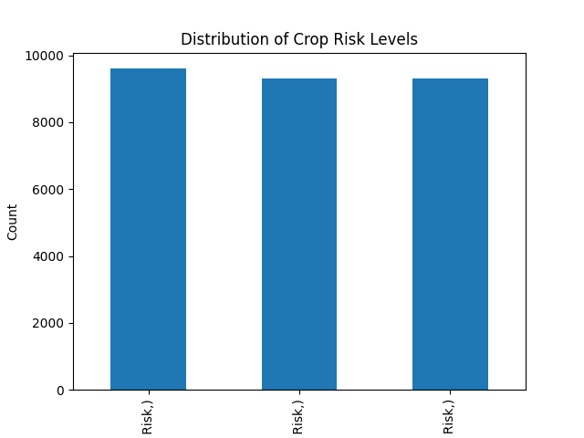
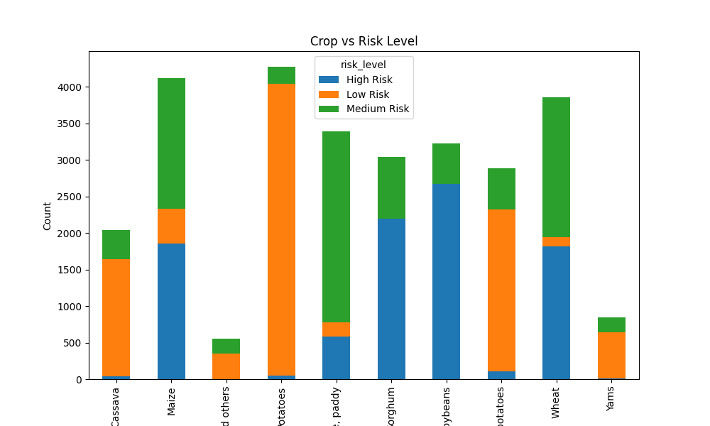
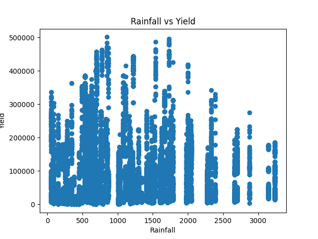
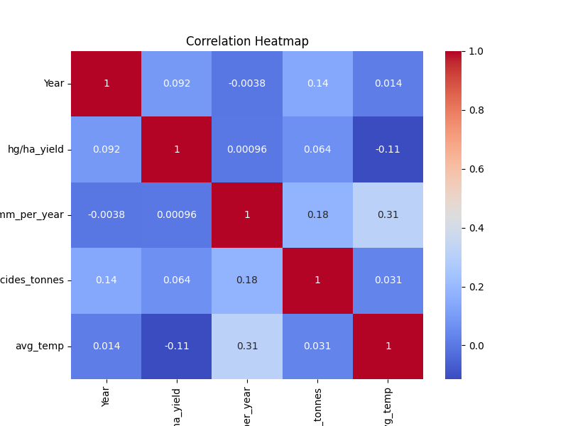
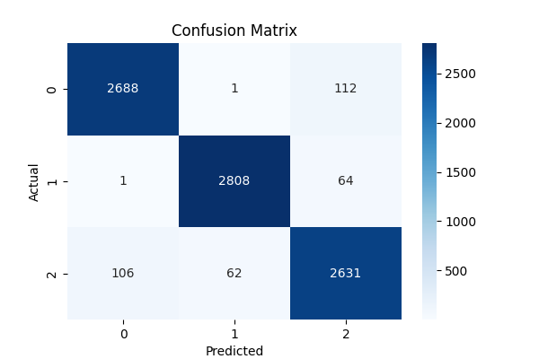
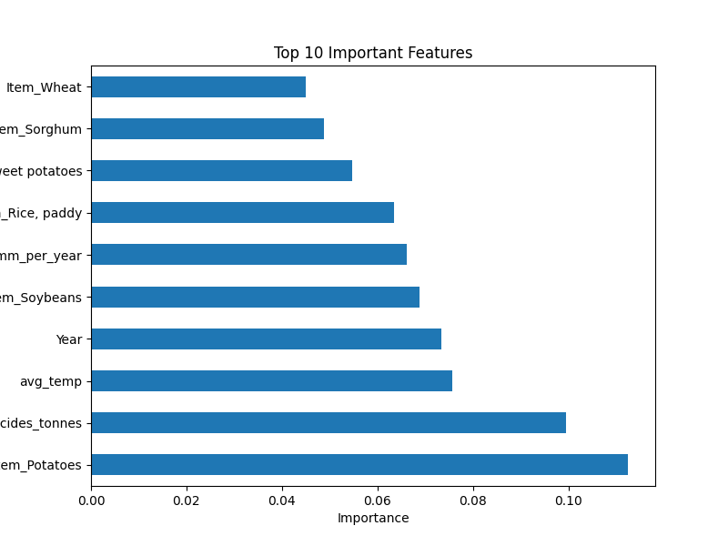

# 🌾 Agricultural Crop Risk Prediction System

## 📌 Problem Statement
Agricultural productivity is highly influenced by environmental and crop-specific factors such as rainfall, temperature, pesticide usage, crop type, and region. Farmers and agricultural planners often lack data-driven insights to assess crop risk effectively.

---

## 🎯 Objective
To develop an end-to-end machine learning model that analyzes agricultural data and predicts crop risk levels (Low, Medium, High), enabling better decision-making and risk management in agriculture.

---

## 📊 Dataset
The dataset consists of ~28,000 records with the following features:
- Area (Country/Region)
- Crop Type (Item)
- Year
- Average Rainfall
- Average Temperature
- Pesticide Usage
- Yield (used to derive target variable)

---

## 🧠 Target Variable
A new feature **`risk_level`** was created from yield values:
- **Low Risk** → High yield  
- **Medium Risk** → Moderate yield  
- **High Risk** → Low yield  

---

## ⚙️ Tech Stack
- Python
- Pandas
- Matplotlib & Seaborn
- Scikit-learn
- VS Code
- Git & GitHub

---

## 🔍 Methodology

### 1. Data Cleaning
- Removed unnecessary columns
- Verified missing values (none found)
- Ensured correct data types

### 2. Exploratory Data Analysis (EDA)
- Analyzed relationships between yield and environmental factors
- Studied crop-wise and region-wise risk distribution
- Identified patterns using visualizations

### 3. Feature Engineering
- Created target variable (`risk_level`)
- Applied one-hot encoding to categorical variables

### 4. Model Building
- Split data into training and testing sets (80-20)
- Trained:
  - Decision Tree Classifier
  - Random Forest Classifier

### 5. Model Evaluation
- Accuracy
- Precision, Recall, F1-score
- Confusion Matrix

---

## 🤖 Models Used
- Decision Tree (Baseline Model)
- Random Forest (Final Model)

---

## 📈 Results

| Model           | Accuracy |
|----------------|---------|
| Decision Tree  | ~96%    |
| Random Forest  | **~97%** |

👉 Random Forest performed better due to improved generalization.

---

## 📊 Visualizations

### Risk Distribution


### Crop vs Risk


### Rainfall vs Yield


### Correlation Heatmap


### Confusion Matrix


### Feature Importance


---

## 🔑 Key Insights

- Crop type is the most influential factor in determining risk
- Environmental variables (rainfall, temperature, pesticides) significantly impact yield
- No single feature strongly correlates with yield → multi-factor dependency
- Medium Risk is hardest to classify due to overlap with other categories
- Random Forest provides more stable and accurate predictions than Decision Tree

---

## ⚠️ Challenges Faced

- Data leakage issue initially (resolved by removing yield from features)
- Handling categorical variables efficiently
- Interpreting overlapping classes (Medium Risk)

---

## 🚀 Future Improvements

- Use real-time weather API integration
- Build a Streamlit dashboard for user interaction
- Apply advanced models (XGBoost, Gradient Boosting)
- Deploy model as a web application
- Add time-series forecasting for yield prediction

---

## 📁 Project Structure

```text
agriculture-crop-risk-prediction/
│
├── data/
│   ├── raw/
│   └── processed/
│
├── notebooks/
│   ├── 01_data_understanding.ipynb
│   └── 02_model_building.ipynb
│
├── models/
│   └── random_forest_model.pkl
│
├── reports/
│   └── (visualizations)
│
├── README.md
└── requirements.txt